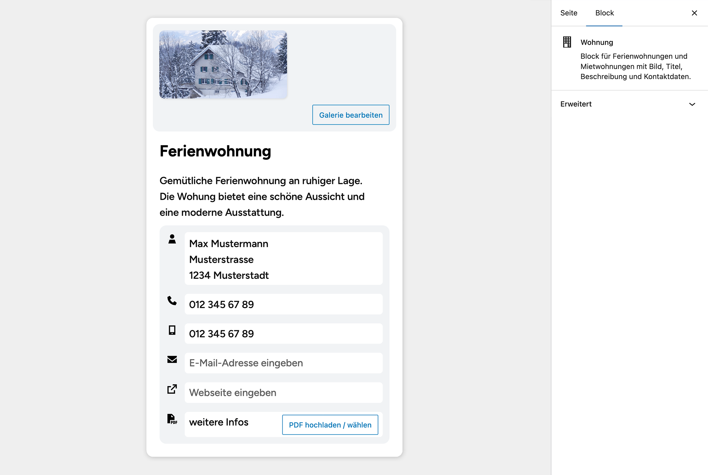
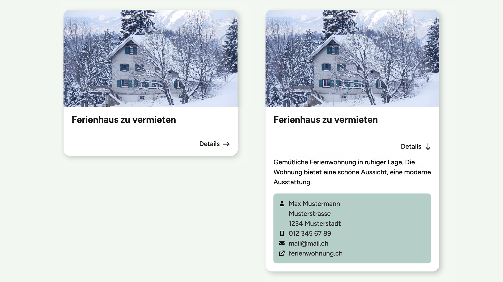

# UD Block: Wohnung

Block zur Darstellung von Ferien- und Mietwohnungen mit Bild, Titel, Beschreibung und Kontaktdaten.
Er eignet sich zur Präsentation einzelner Wohnungen oder Inserate, inklusive Download-Link und externen Verweisen.

---

## Funktionen

* **Strukturierte Wohnungsdarstellung**

  * Titel, Beschreibung und Kontaktdaten (Name, Adresse, Telefon, E-Mail, Website)
  * Unterstützt mehrere Bilder pro Wohnung (Galerie)
  * Optionaler PDF-Link (z. B. für Exposé oder Grundriss)

* **Editor-Integration**

  * Bilderauswahl direkt über die Medienbibliothek
  * Inline-Eingabe für Titel, Text und Kontaktdaten
  * Echtzeit-Vorschau im Block-Editor (FSE-kompatibel)

* **Frontend-Layout**

  * Responsives Karten-Layout mit Bild und Text
  * Automatische Verlinkung von Telefon-, Mail- und Webadressen
  * Optionaler Download-Button für PDF-Dateien

---

## Screenshots

### Editor-Ansicht

*Abbildung: Eingabefelder für Bilder, Text und Kontaktdaten.*

### Frontend-Ansicht

*Abbildung: Darstellung einer Wohnungskarte im Frontend.*

---

## Technische Details

* **Blockname:** `ud/wohnung-block`
* **Render-Datei:** `includes/render.php`
* **Hilfsfunktionen:** `includes/helpers.php`
* **Styles:**

  * `src/css/editor.scss`
  * `src/css/frontend.scss`
* **Skripte:**

  * `src/js/edit.js`
  * `src/js/frontend.js`

### ⚙️ Attribute

| Attribut      | Typ    | Beschreibung                        |
| ------------- | ------ | ----------------------------------- |
| `mediaIds`    | array  | IDs der ausgewählten Bilder         |
| `mediaUrls`   | array  | URLs der Bilder                     |
| `title`       | string | Titel der Wohnung                   |
| `text`        | string | Beschreibungstext                   |
| `nameAddress` | string | Name und Adresse der Ansprechperson |
| `phone`       | string | Telefonnummer                       |
| `mobile`      | string | Mobilnummer                         |
| `email`       | string | Kontakt-E-Mail                      |
| `url`         | string | Website oder externe URL            |
| `pdf`         | string | Link zur PDF-Datei                  |
| `pdfLabel`    | string | Beschriftung des PDF-Buttons        |

---

## Installation

1. Plugin-Ordner `ud-wohnung-block` nach `wp-content/plugins/` kopieren
2. Im WordPress-Backend unter **Plugins → Installierte Plugins** aktivieren
3. Im Block-Editor den Block **„Wohnung“** hinzufügen und konfigurieren

---

## Anforderungen

* WordPress ≥ 6.7
* PHP ≥ 7.4

---

## Autor

**ulrich.digital gmbh**
[https://ulrich.digital](https://ulrich.digital)

---

## Lizenz

GPL v2 or later
[https://www.gnu.org/licenses/gpl-2.0.html](https://www.gnu.org/licenses/gpl-2.0.html)
